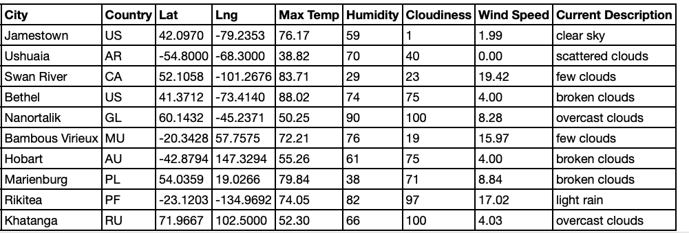
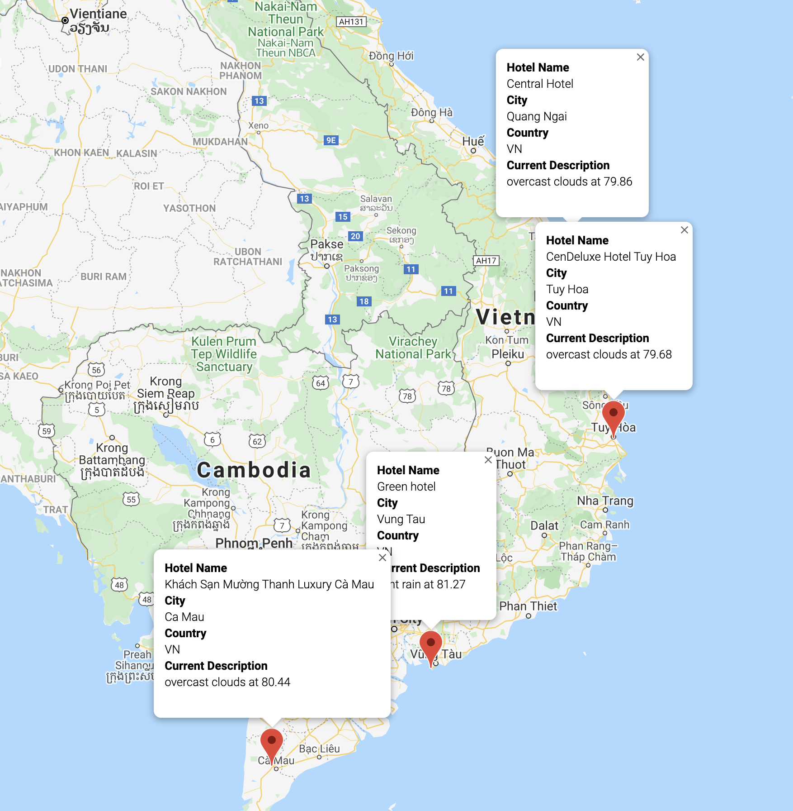

# World Weather Analysis

## Overview
Our goal was to collect data, analyze it with visualizations, and then create a heatmap of hotels in nearby cities that met our criteria.

We created randomized numbers to represent latitudes and longitudes in tuples, then explored the correlations between weather in different latitudes and longitudes to look for ideal conditions. It was helpful to visualize these as scatterplots, and understand weather patterns, if any.
We then used an API to match those locations with the nearest city, removing rows that did not compute.  We took that list of cities, mapped them using another API, and found location information about nearby hotels. 

The feedback from the first iteration showed that we needed to add the weather description to the weather data we'd already retrieved. Then, allow users to give input statements to filter the data for their weather preferences, which will be used to identify potential travel destinations and nearby hotels. From the list of potential travel destinations, a user can choose four cities to create a travel itinerary - ideally within driving distance. Finally, using the Google Maps Directions API, we created a travel route between the four cities as well as a marker layer map.

## Analysis

We retrieved data, created a custom travel destinations map, and from there a travel itinerary map. Feedback showed that visualizing the cities and hotels was incredibly important for users in making quick decisions about their destination plans instead of looking at a giant list of places they might want to go. 

### Table view vs itinerary map view

## Summary
Limitations of this data as reported by users include that knowing the rating and price information of the hotels would be a key way to help them select if they wanted to commit to the trip. This would be important if certain places wanted to be seen or highlighted on the map for potential customers in this app, and would help build confidence in the quality of the experiences these cities and hotels provide. Customers would also like to see a photo of the location in the input box that displays when a city/hotel is selected, to get a better idea of the country and its weather.
